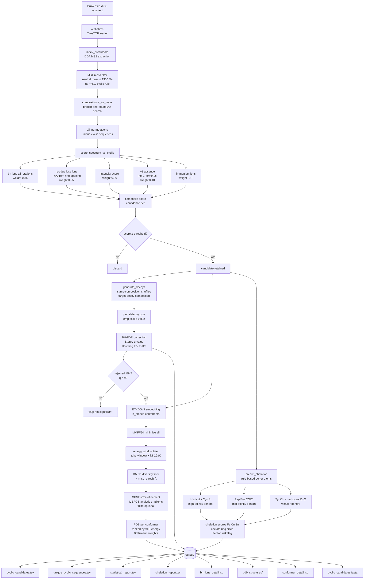

# 🔄 Wine CycloPep — De novo Cyclic Peptide Discovery from Bruker timsTOF PASEF

> *Step 3 of the Wine Peptidome series — de novo detection of cyclic peptides (≤ 1300 Da) directly from `.d` folders, statistical FDR validation (empirical p-values, BH correction, Storey q-value, Hotelling T²/F), publication-quality 3D conformer generation (ETKDGv3 → MMFF94 → GFN2-xTB), and rule-based metal chelation prediction for wine lees bioactive compounds.*

[](https://www.python.org/)
[](LICENSE)
[](https://www.rdkit.org/)
[](https://github.com/MannLabs/alphatims)
[](https://github.com/tblite/tblite)
[](https://orcid.org/0000-0002-7720-3733)

---

## 🍷 Where this fits in the Wine Peptidome series

This is **Step 3** of the Wine Peptidome programmatic pipeline:

| Step | Repository | What it does |
|------|-----------|--------------|
| **1** | [WinePeptidome](https://github.com/314Olamda/WinePeptidome) | Retrieves all *S. cerevisiae* & *V. vinifera* proteins (500 Da – 100 kDa) from UniProt REST API + Proteins API. Outputs UniProt accessions, sequences, experimental peptide evidence, PTM sites. |
| **2** | [WineStructure](https://github.com/314Olamda/WineStructure) | Takes those accessions into the AlphaFold Database API. Downloads predicted 3D structures, per-residue pLDDT confidence, and PAE matrices. |
| **3** | **WineCycloPep ← you are here** | Reads raw Bruker `.d` folders directly. Detects cyclic peptide candidates (≤ 1300 Da) by MS1/MS2 signature, applies target-decoy FDR validation, generates statistically selected GFN2-xTB-refined 3D conformers, and predicts metal chelation capacity. |

Feed the output of Steps 1–2 and raw instrument data into Step 3:

```
WinePeptidome/output/sequences.fasta  ─┐
WineStructure/output/pdb_structures/  ─┤──▶  wine_cyclopep.py
sample.d  (Bruker timsTOF PASEF)      ─┘
```

---

## 🔬 Why cyclic peptides matter in wine lees

Wine lees — the yeast-rich sediment produced during and after fermentation — release a diverse array of low-molecular-weight peptides through autolysis during *sur lies* aging. Among these, **cyclic peptides** (head-to-tail amide bond, no free N/C terminus) are of particular biotechnological interest because:

- **Enhanced stability** — resistant to exopeptidases; survive enological processing and acidic wine pH
- **Antifungal activity** — cyclic dipeptides (diketopiperazines, DKPs) from *Saccharomyces cerevisiae* autolysis are known antifungal agents against *Phaeoacremonium minimum* and *Phaeomoniella chlamydospora* (Petri disease pathogens)
- **Metal chelation** — donor atoms in cyclic scaffolds (His, Cys, Asp, Glu, Tyr) can coordinate Fe²⁺/Cu²⁺/Zn²⁺, relevant to the antioxidant and Fenton-inhibitory activity of wine lees fractions
- **SO₂ alternative potential** — metal chelation + radical scavenging from a single stable cyclic scaffold supports the PROPEPT research hypothesis
- **CRISPR engineering target** — defined cyclic scaffolds with predicted bioactivity are prime candidates for CRISPR-directed overproduction in engineered yeast

The **≤ 1300 Da mass window** covers 2–10 residue cyclic peptides including all known biologically active diketopiperazines, cyclic tripeptides, and tetrapeptides from yeast metabolism.

---

## 🧬 Pipeline Architecture



---

## ⚡ Quick start

```bash
# 1. Clone
git clone https://github.com/314Olamda/WineCycloPep.git
cd WineCycloPep

# 2. Install dependencies
pip install alphatims scipy
# RDKit (required for 3D):
conda install -c conda-forge rdkit
# GFN2-xTB refinement (optional, strongly recommended):
pip install tblite

# 3. Run — full pipeline with xTB
python wine_cyclopep.py --d path/to/sample.d

# 4. Run — MMFF only (no xTB), fast screening
python wine_cyclopep.py --d path/to/sample.d --no_xtb

# 5. Quick test on first 500 spectra
python wine_cyclopep.py --d path/to/sample.d --max_spectra 500
```

No Bruker SDK licence required. The pipeline reads `.d` folders via **alphatims** (open source, Mann Labs).

---

## ⚙️ Configuration

All parameters are adjustable via CLI flags:

```bash
python wine_cyclopep.py \
    --d           sample.d       \  # Bruker .d folder (required)
    --min_aa      2              \  # minimum residues (default 2)
    --max_aa      9              \  # maximum residues (default 9)
    --mass_max    1300.0         \  # hard Da ceiling (default 1300)
    --tol         0.02           \  # fragment mass tolerance, Da
    --min_score   0.10           \  # minimum composite score to report
    --centroid    3              \  # MS2 centroiding window
    --top_peaks   50             \  # most abundant MS2 peaks per spectrum
    --max_perms   200            \  # max permutations per composition
    --allowed_aa  GAILVFWM       \  # restrict AA alphabet (optional)
    --hints       VAAG,GGF,IAA  \  # sequences to prioritize (optional)
    --n_embed     200            \  # conformers to embed (more = better sampling)
    --kt_window   2.0            \  # energy window in × kT(298K) for selection
    --rmsd_thresh 0.5            \  # min RMSD Å between selected conformers
    --no_xtb                     \  # skip GFN2-xTB refinement
    --metals      Fe,Cu,Zn       \  # metals for chelation prediction
    --n_decoys    100            \  # decoy shuffles per candidate (FDR)
    --fdr_alpha   0.05              # FDR significance threshold
```

---

## 🔍 Cyclic peptide detection — the MS signature

Linear and cyclic peptides of the same composition have **identical nominal mass at MS1 level** — the distinction is entirely in the fragmentation pattern. The pipeline uses five orthogonal criteria:

### 1. MS1 mass filter — the −H₂O rule

A cyclic (head-to-tail) peptide has no free N- or C-terminus. The intramolecular amide bond eliminates one water molecule, so:

```
M_cyclic = Σ residue masses          (no +18.011 Da)
M_linear = Σ residue masses + 18.011 Da
```

Every precursor neutral mass is checked against the sum of residue masses (no +H₂O) within `--tol` Da tolerance, capped at `--mass_max` Da.

### 2. Residue-loss ions (diagnostic, weight 0.25)

The first fragmentation step from a cyclic [M+H]⁺ opens the ring by ejecting one residue:

```
[M+H]⁺  →  [M+H − residue_mass_AA]⁺  +  AA (neutral)
```

For cyclo(Ile-Ala-Ala) [M+H]⁺ = 256.17:

| Ion | m/z |
|-----|-----|
| loss of A (71.04) | 185.13 |
| loss of I (113.08) | 143.08 |

### 3. bₙ ions from all ring-opening positions (weight 0.35)

A cyclic peptide with *n* residues has *n* possible ring-opening sites, each generating a distinct b-ion ladder. Linear peptides produce a **single** b-ion series; cyclic peptides produce **overlapping ladders from multiple start positions** — the most reliable diagnostic.

For cyclo(IAA): 3 rotations × 2 bₙ ions = 6 unique fragment masses, vs. 2 b ions for linear IAA.

### 4. Absence of y₁ ions (weight 0.10)

A linear peptide always produces a strong y₁ ion (C-terminal residue + H₂O + H). Cyclic peptides have no C-terminus, so y₁ ions are absent or very weak.

### 5. Immonium ions (weight 0.10)

Residue-specific immonium ions (residue_mass − CO + H) confirm composition and are present in both linear and cyclic peptides — used for residue validation rather than cyclicity per se.

### Composite score and confidence tiers

```
composite = 0.35 × bn_coverage + 0.25 × loss_coverage +
            0.20 × intensity_score + 0.10 × y1_absence +
            0.10 × immonium_score
```

| Score | Tier | Interpretation |
|-------|------|----------------|
| ≥ 0.60 | **HIGH** | Strong cyclic evidence; recommended for experimental confirmation |
| 0.35–0.59 | **MEDIUM** | Probable cyclic; validate with CycloBranch or authentic standard |
| 0.15–0.34 | **LOW** | Possible; may be linear isomer or chimeric spectrum |
| < 0.15 | VERY_LOW | Discard or review manually |

---

## 📊 Statistical validation — FDR, F-statistic, q-value

A composite score alone has no null distribution — a score of 0.40 on a tripeptide means something very different to 0.40 on a nonapeptide. The statistical validation module provides a rigorous framework adapted from target-decoy competition in shotgun proteomics (Elias & Gygi 2007).

### Target-decoy competition

For each candidate sequence, the **same MS2 spectrum** is rescored against shuffled sequences of identical amino acid composition (same mass → same MS1 filter behaviour). These decoys define the null: how high can scores reach purely by chance at this composition and spectrum complexity?

Decoy sequences are generated by permuting residue order, excluding all cyclic rotations of the original. For short sequences (< 4 residues) with few unique permutations, isobaric substitution is used (I↔L, which share monoisotopic mass 113.084 Da). All decoy scores are pooled into a **global null distribution**, mirroring the standard proteomics approach and solving the degeneracy problem for short peptides.

### Empirical p-value

```
p_i = (|{decoy scores ≥ target_score_i}| + 1) / (N_decoys + 1)
```

The +1 Laplace pseudocount prevents p = 0 for extreme scores not represented in the decoy pool, yielding a conservative estimate. If fewer than 20 decoys were available for a candidate, `stat_note = low_decoy_count` is set and the p-value should be interpreted with caution; the global pool p-value remains valid.

### Benjamini-Hochberg FDR correction

The standard step-up procedure (Benjamini & Hochberg 1995) controls the expected proportion of false discoveries among all rejected null hypotheses. Assumes independence or positive regression dependency (PRDS) between tests — satisfied here because all candidates are scored against the same global decoy pool.

```
Reject H₀_i  if  p_(i) ≤ (i/m) × α
```

BH-adjusted p-values and a `rejected_BH` boolean are reported per candidate.

### Storey q-value

The Storey & Tibshirani (2003) q-value extends BH by estimating π₀ — the proportion of truly null hypotheses — from the tail of the p-value distribution. When many candidates are real signals (π₀ < 1), the q-value is less conservative than BH and provides better power. The π₀ estimate is reported in `statistical_report.tsv`.

```
q_i = π₀ × m × p_(i) / i      (with step-up monotone enforcement)
```

**Use `q_storey` as your primary reporting metric in publications** — it is the direct analogue of the FDR reported in proteomics papers.

### Hotelling T² / F-statistic (multivariate)

Tests whether the **5-dimensional score vector** (all scoring dimensions jointly) separates targets from the global decoy pool:

```
H₀: μ_target = μ_decoy   (in 5D score space)

T² = (n₁n₂)/(n₁+n₂) × (μ₁−μ₂)ᵀ Sₚ⁻¹ (μ₁−μ₂)

F = T² × (n₁+n₂−p−1) / ((n₁+n₂−2) × p)  ~  F(p, n₁+n₂−p−1)
```

This answers the question: "do the five criteria *jointly* discriminate cyclic peptides from the null, beyond what any single criterion achieves?" A significant F-statistic validates the scoring function itself, not just individual candidates.

Per-dimension Mann-Whitney U tests (non-parametric, one-tailed) with BH correction are also reported in `statistical_report.tsv`, identifying which scoring dimensions contribute most to the separation.

### Statistical outputs per candidate

| Column | Content |
|--------|---------|
| `p_value_empirical` | One-tailed empirical p-value against global decoy pool |
| `p_adj_BH` | Benjamini-Hochberg adjusted p-value |
| `q_storey` | Storey q-value (use this for publication reporting) |
| `rejected_BH` | Boolean — significant at `--fdr_alpha` after BH correction |
| `n_decoys_in_pool` | Size of the global decoy pool used |
| `stat_note` | `ok` or `low_decoy_count` |

---

## 🧱 3D conformer generation — statistical selection + GFN2-xTB

Conformers are not selected by rank. The pipeline uses a three-stage physically motivated approach that retains every conformer that is **thermodynamically relevant** and **structurally distinct**.

### Stage 1 — Embedding

Head-to-tail cyclic SMILES are built from sequence (stereocentres at Cα as `[C@@H]`). ETKDGv3 generates `--n_embed` starting geometries using experimentally derived torsion preferences and macrocycle torsion parameters (enabled automatically for rings ≥ 8 residues).

### Stage 2 — MMFF94 minimization of all embeddings

Every conformer is minimized with MMFF94 (fallback: UFF). This provides the energy surface for the statistical selection step.

### Stage 3 — Statistical conformer selection

**Energy window filter:** retain conformers within `--kt_window × kT(298K)` of the global minimum.

```
keep  if  E_i  ≤  E_min + kt_window × 0.593 kcal/mol
```

At the default of 2.0 kT, this retains ~87% of the Boltzmann equilibrium population at room temperature. Conformers outside this window contribute < 13% to the partition function and are thermodynamically negligible. Changing `--kt_window` shifts the stringency: 1 kT (strict, ~63% population), 5 kT (permissive, ~99%).

**RMSD diversity filter:** within the energy-selected pool, discard any conformer with heavy-atom RMSD < `--rmsd_thresh` Å to an already-kept conformer. This removes structurally redundant frames while preserving genuine ring puckers, cis/trans amide isomers, and sidechain rotamers.

**Boltzmann weights** are computed for all retained conformers and reported in `conformer_detail.tsv`.

### Stage 4 — GFN2-xTB refinement (optional, strongly recommended)

Each selected MMFF conformer is re-optimized with **GFN2-xTB** (Bannwarth et al. 2019) using L-BFGS with analytic gradients via `tblite` + `scipy`. Typically converges in 15–30 gradient evaluations (0.2–2 s per conformer depending on ring size).

GFN2-xTB captures hydrogen bonding geometry, correct amide planarity, and intramolecular electrostatics — all significant limitations of MMFF94 for polar cyclic peptides — at approximately 1/1000 the cost of DFT.

The conformer ensemble is re-ranked by xTB energy after refinement. `xTB_delta_e` gives the energy gap from the xTB global minimum.

### Reliability by ring size

| Ring size | MMFF94 | + GFN2-xTB | Notes |
|-----------|--------|------------|-------|
| 2–4 aa (DKPs, 6–12 membered) | ✅ Good | ✅ Excellent | MMFF94 and xTB both well-validated for small rings |
| 5–7 aa (15–21 membered) | 🟡 Moderate | ✅ Good | xTB captures H-bond network that MMFF misses |
| 8–9 aa (24–27 membered) | ⚠️ Lower | 🟡 Moderate | Consider explicit-solvent MD for publication-grade structures |

Proline-containing sequences are flagged (`status = proline`) — the pyrrolidine ring requires a separate SMILES strategy and is not modelled in the current version.

### Visualisation

```bash
# All conformers of one candidate in PyMOL
pymol output/pdb_structures/cyclo_VAAG/*.pdb

# Colour by Boltzmann weight rank
# conf01 = global minimum, conf02 next, etc.

# ChimeraX
chimerax output/pdb_structures/
```

---

## ⚗️ Metal chelation prediction

Metal chelation by cyclic peptides is relevant to:
- **Antioxidant activity** — Fe²⁺/Cu²⁺ chelation prevents Fenton reaction (H₂O₂ + Fe²⁺ → •OH)
- **SO₂ alternative activity** — metal sequestration reduces oxidation catalysis in wine
- **Antifungal mechanism** — zinc chelation disrupts fungal metalloenzymes

The pipeline applies a **rule-based donor atom score** that does not require docking or quantum chemistry. It mirrors established coordination chemistry literature for short peptides:

### Donor atom scoring table

| Residue | Atom | Donor type | Fe²⁺ | Cu²⁺ | Zn²⁺ |
|---------|------|-----------|------|------|------|
| His | Nε2 (imidazole) | N-donor | ++ | +++ | +++ |
| Cys | S (thiol) | S-donor | + | +++ | ++ |
| Asp/Glu | COO⁻ (carboxylate) | O-donor | ++ | + | + |
| Tyr | OH (phenol) | O-donor | + | ++ | + |
| Asn/Gln | C=O (amide) | O-donor | + | + | — |
| backbone | C=O (peptide) | O-donor | + | + | — |

**Scoring:**
- Each donor atom contributes a weighted score per metal following the Irving-Williams series
- Geometric feasibility bonus: ≥ 2 donor atoms within ≤ 3 residues of each other in the cyclic ring → favourable chelate ring formation
- 5- and 6-membered chelate rings score higher than 4- or 7-membered
- `fenton_risk_reduction = True` when both Fe²⁺ and Cu²⁺ scores ≥ 0.35

**Important note:** these are *predicted* values based on residue composition and ring geometry. Experimental confirmation requires ITC, EPR, or UV-Vis metal titration assays.

---

## 📦 Output files

| File | Content |
|------|---------|
| `cyclic_candidates.tsv` | All candidates per spectrum: RT, m/z, charge, neutral mass, 1/K₀, sequence, all score dimensions, confidence, p-value, BH p-adj, q-value |
| `unique_cyclic_sequences.tsv` | Best hit per canonical cyclic sequence with full statistical annotation |
| `statistical_report.tsv` | Global statistics: T², F(df1,df2), p-value, π₀, n_rejected, decoy pool metrics, per-dimension Mann-Whitney U + BH |
| `chelation_report.tsv` | Per-sequence chelation scores (Fe/Cu/Zn), donor atoms, chelate ring sizes, Fenton flag |
| `bn_ions_detail.tsv` | Per-ion table for top 50 candidates: theoretical vs observed m/z, Δ Da, matched flag |
| `pdb_structures/cyclo_<SEQ>/` | Subdirectory per sequence; one PDB per retained conformer (`conf01.pdb` = global minimum) |
| `conformer_log.tsv` | Per-sequence summary: n_embedded, n_selected, global min energy, xTB status |
| `conformer_detail.tsv` | Per-conformer: MMFF energy, xTB energy, ΔE, Boltzmann weight, convergence |
| `cyclic_candidates.fasta` | FASTA of unique sequences → feed into ColabFold / ESMFold |
| `pipeline_summary.txt` | Run statistics, confidence and FDR distribution, top 10 table |

---

## 🔗 Series & related resources

- **Step 1:** [WinePeptidome](https://github.com/314Olamda/WinePeptidome) — UniProt retrieval pipeline
- **Step 2:** [WineStructure](https://github.com/314Olamda/WineStructure) — AlphaFold 3D structures + pLDDT
- [alphatims](https://github.com/MannLabs/alphatims) — Bruker `.d` file reader (Mann Labs)
- [tblite](https://github.com/tblite/tblite) — GFN2-xTB Python interface (Grimme group)
- [CycloBranch](https://ms.biomed.cas.cz/cyclobranch/) — MS-based cyclic peptide sequencing for experimental validation
- [GNPS molecular networking](https://gnps.ucsd.edu/) — downstream spectral annotation and dereplication
- [RDKit](https://www.rdkit.org/) — cheminformatics for SMILES building and conformer generation
- [ColabFold](https://github.com/sokrypton/ColabFold) — structure prediction for novel sequences from `cyclic_candidates.fasta`
- [reLees project](https://relees.uniwa.gr) — wine lees circular economy research

---

## 📄 Citation

```bibtex
@software{gimenez_gil_wine_cyclopep_2025,
  author  = {Giménez-Gil, Pol},
  title   = {Wine CycloPep: De novo Cyclic Peptide Discovery from Bruker timsTOF PASEF},
  year    = {2025},
  url     = {https://github.com/314Olamda/WineCycloPep},
  orcid   = {0000-0002-7720-3733},
  note    = {Step 3 of the Wine Peptidome series.
             Step 1: github.com/314Olamda/WinePeptidome
             Step 2: github.com/314Olamda/WineStructure}
}
```

---

## 👤 Author

**Pol Giménez-Gil**, PhD
Postdoctoral Researcher — ISVV, Université de Bordeaux
Scopus ID: 57219336109 · ORCID: [0000-0002-7720-3733](https://orcid.org/0000-0002-7720-3733)
ResearchGate: [Pol_Gimenez2](https://www.researchgate.net/profile/Pol_Gimenez2)

---

## 📜 License

MIT — see [LICENSE](LICENSE)
